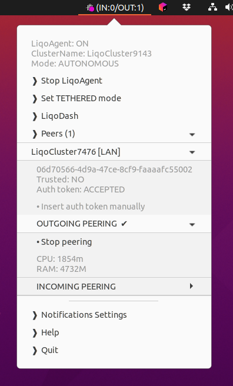
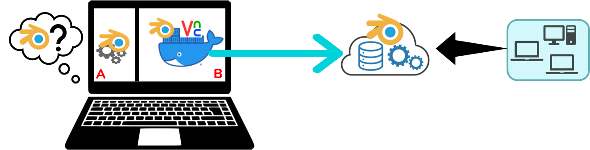

<h1 align="center">Liqo Agent</h1>

<h3 align="center"> Sharing <a href=https://github.com/kubernetes/kubernetes>Kubernetes</a> resources made easy
</h3>

<p align="center">
	
</p>


## About the project
Liqo Agent is a tray-agent application providing an easy-to-use GUI for desktop users 
of the [Liqo](https://github.com/liqotech/liqo) platform.

<details open="open">
  <summary>Table of Contents</summary>
  <ol>
    <li><a href="#theidea">The Idea</a></li>
    <li><a href="#mainfeatures">Main Features</a></li>
    <li><a href="#installation">Installation</a></li>
  </ol>
</details>

## The idea

In the least years **containerization** and **orchestration** technologies led to the 
spread of *lightweight virtualization*, allowing an easier portability of applications 
across devices, and their advanced management in terms of dependencies, requirements and lifecycle.

The [Liqo](https://github.com/liqotech/liqo) project, started at Politecnico of Turin,
took a step further in this process by providing a dynamic and decentralized *resource sharing* protocol 
to temporarily orchestrate resources coming also from Kubernetes clusters which are under
different administrative entities.

**Liqo Agent** was developed as a side project to integrate Liqo with the desktop environment,
with the goal of providing a simple mechanism for common users to launch their applications, 
regardless of the physical device where they are actually running on.



By means of a tray menu and desktop notifications, users can easily manage the composition of their resource pool
by requesting and receiving peering connections, and then let Kubernetes transparently orchestrate the execution of their applications.

## Main features

* **Control your Liqo cluster with just few clicks**: monitor at a glance the running status of your Liqo instance on
a local or remote Kubernetes cluster
  
* **Available peers**: scroll the list of all available peers and get all information you need, e.g. 
  cluster's unique identifier or authentication process between clusters (required for peering) 
  
* **Handle Liqo peerings**: click on a peer and start consuming its resources. Your Kubernetes cluster will 
automatically manage them without any intervention. You can also share your own resources.
  
* **Connect to LiqoDash**: log in to your [LiqoDash](https://github.com/liqotech/dashboard)
with a token based authentication (automatically provided in the clipboard)
  
* **Desktop notifications**: You can keep focusing on your work while always informed on main Liqo events thanks
to desktop banner notifications

## Installation

Liqo Agent is currently available only for GNU/Linux distributions as 
[XDG](https://www.freedesktop.org/wiki/Specifications/) application.

You can easily try it by launching its installer:

```bash
curl -sL https://raw.githubusercontent.com/liqotech/liqo-agent/master/install.sh | bash
```
**Note**: Liqo Agent needs a [kubeconfig](https://kubernetes.io/docs/concepts/configuration/organize-cluster-access-kubeconfig/)
file on the local file system in order to connect to the _Home_ kubernetes cluster. 
The default choice is: ```HOME/.kube/config```. 
You can easily select a different one by previously exporting the **KUBECONFIG** environment variable:
```bash
export KUBECONFIG=<KubeconfigPath>
```


